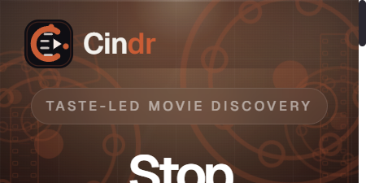
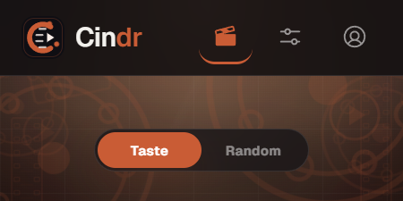

<div align="center">

<br/>


<br/>
<br/>

**Instead of swiping for dates, you swipe for movies.**

<br/>

[](https://cindr-red.vercel.app)
&nbsp;&nbsp;
[](https://cindr-red.vercel.app)
&nbsp;&nbsp;
[](https://cindr-red.vercel.app)

<br/>

---

</div>

## What is Cindr?

Cindr is a taste-led movie discovery app. Instead of scrolling through endless lists, you swipe — left to skip, right to like, up to watch the trailer. The more you swipe, the smarter it gets.

No account needed to start. Just open it and swipe.

<div align="center">
<br/>

| | |
|:---:|:---:|
|  |  |
| **Home** | **Discover** |

<br/>
</div>

---

## How it works

```
← Swipe left   →  Skip a movie
→ Swipe right  →  Like it
↑ Swipe up     →  Watch the trailer
```

After a few likes, Cindr's **CindrSense** algorithm learns your taste — genres, vibes, era, language — and starts weighting your feed toward what you'll actually enjoy. Every swipe teaches it something. Recent taste always wins so it never goes stale.

---

## Features

- **Swipe-based discovery** — no lists, no filters, just cards
- **Inline trailers** — swipe up or tap the trailer button to preview
- **CindrSense recommendations** — learns from every swipe in real time
- **Taste mode / Random mode** — toggle between personalised and serendipitous
- **Watchlist** — liked, favourited, and watched lists sync to your account
- **Guest-friendly** — full discovery without signing in; account syncs your history when you do
- **Works on any screen** — designed mobile-first, works on desktop too

---

## Try it

**[https://cindr-red.vercel.app](https://cindr-red.vercel.app)**

No install. No account required. Works on any modern browser.

---

## Tech

Built with Next.js, Supabase, Framer Motion, TMDB, and Cloudinary. Source is private.

---

## Privacy

Cindr does not sell or share your data. Swipe history stays on your device until you create an account. See [docs/privacy.md](docs/privacy.md) for the full policy.

---

<div align="center">

<br/>

Made with taste &nbsp;·&nbsp; [cindr-red.vercel.app](https://cindr-red.vercel.app)

<br/>

</div>
